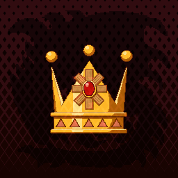

<p align="center">
  
</p>

<h1 align="center">Crown Guild</h1>
<p align="center">Crown tracking and matchmaking for Monster Hunter Wilds</p>

<p align="center">
  
  
  
  
  
</p>

---

Log your Monster Hunter Wilds crown records, find hunters running investigation quests, and coordinate hunts in real time. Crown Guild stays in sync with the companion Discord bot — every slash command is reflected on the dashboard instantly.

**Features**

- Crown registry with per-monster and crown type filtering
- Hunter profiles with investigation quest use tracking
- Live mission board updated in real time via Pusher
- Beacon system — broadcast that you need help on a specific crown
- Discord OAuth sign-in

---

## Setup

You need Node 18+, a [Turso](https://turso.tech/) database, a Discord application with OAuth2, and a [Pusher](https://pusher.com/) Channels app.

```bash
npm install
cp .env.example .env.local
# fill in .env.local
npm run dev
```

App runs at `http://localhost:3000`.

For production on Vercel, add all env vars under **Project → Settings → Environment Variables** and set `NEXTAUTH_URL` to your deployed domain.

---

## Environment Variables

| Variable | Description |
|---|---|
| `DISCORD_TOKEN` | Bot token — used server-side to fetch Discord user data |
| `DISCORD_CLIENT_ID` | OAuth2 application client ID |
| `DISCORD_CLIENT_SECRET` | OAuth2 application client secret |
| `DISCORD_PUBLIC_KEY` | Interaction endpoint verification key |
| `TURSO_DB_URL` | `libsql://` URL to your Turso database |
| `TURSO_AUTH_TOKEN` | Auth token from Turso |
| `NEXTAUTH_URL` | Canonical URL of this app (`http://localhost:3000` in dev) |
| `AUTH_SECRET` | Session encryption secret — `openssl rand -hex 32` |
| `PUSHER_APP_ID` | Pusher app ID (server-side) |
| `PUSHER_SECRET` | Pusher secret key (server-side) |
| `NEXT_PUBLIC_PUSHER_KEY` | Pusher publishable key (exposed to client) |
| `NEXT_PUBLIC_PUSHER_CLUSTER` | Pusher cluster region, e.g. `us2` |
| `NEXT_PUBLIC_WEB_URL` | Public URL of this app — used in share links |
| `UPSTASH_REDIS_REST_URL` | Upstash Redis URL for rate limiting (optional in dev) |
| `UPSTASH_REDIS_REST_TOKEN` | Upstash Redis token |

---

## Real-time Events

All events are pushed on `public-channel`. Both the web app and the Discord bot trigger them — changes from either side appear immediately on every connected client.

| Event | Trigger | Effect |
|---|---|---|
| `crown_update` | Crown added, edited, or deleted | Refreshes registry and profiles |
| `mission_update` | Mission requested, confirmed, or completed | Updates the live board and mission panel |
| `beacon_update` | Beacon raised or dismissed | Shows or hides the beacon popup |

---

## API Routes

**Auth**
- `GET/POST /api/auth/[...nextauth]` — Discord OAuth

**Crowns**
- `POST /api/crowns` — Add a crown
- `PUT /api/crowns/[id]` — Update a crown
- `DELETE /api/crowns/[id]` — Delete a crown

**Missions**
- `POST /api/missions/beacon` — Raise a beacon
- `GET /api/missions/check` — Check if a mission is active for the current session
- `POST /api/missions/complete` — Complete an active mission
- `GET /api/missions/current` — Fetch all active missions

**Other**
- `GET /api/monsters` — List all monsters
- `GET /api/user` — Get current user profile

---

## Related

[Crown Guild Bot](https://github.com/Simplezes/Crown-Guild-Discord) — the companion Discord bot that handles slash commands and triggers Pusher events to keep this dashboard in sync.

---

## License

MIT
